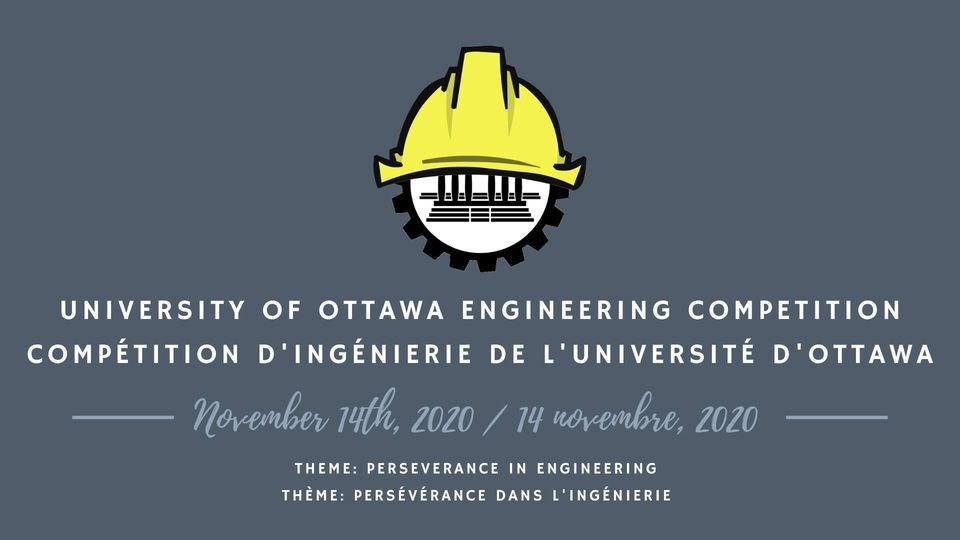

Get ready for another innovative edition of the University of Ottawa Engineering Competition! This year, the competition will be held online on Discord on the 14th of November 2020. The prizes for the competition will be announced shortly so keep an eye out! The competition is divided into 8 smaller competitions: consulting, engineering communications, innovative design, junior design, a parliamentary debate, programming, senior design and re-engineering. 

The description of the problems posed for every competition has been included below.
[Problem details](https://docs.google.com/document/d/1uee-vdT5FuVlD812yM_9XjTOk7BhZwi6EgF3smlDRZ4/edit?usp=sharing)

