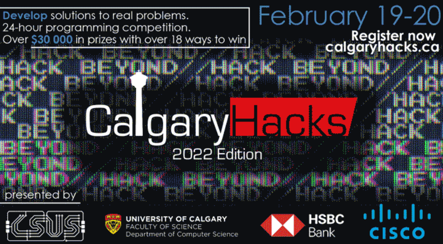

CalgaryHacks 2022 will take place Feb 19-20 (weekend before reading week). This will be the largest CalgaryHacks to date with over $30,000 in cash prizes with 18 ways to win. The Tier 1 prize pool is $15,000 with first place earning $5,000. 

There is also a $3,750 prize pool for first years and highschool students! This hackathon is a great learning opportunity and as such, students of all levels are invited to hack and have fun.

Graduate students are also welcome to participate as judges in the hackathon. Please email csus@ucalgary.ca for more information on this.

Click <a href="https://calgary-hacks-2022.devpost.com/">here</a> to register or click <a href="https://calgaryhacks.ca/">here</a> to visit the website.

